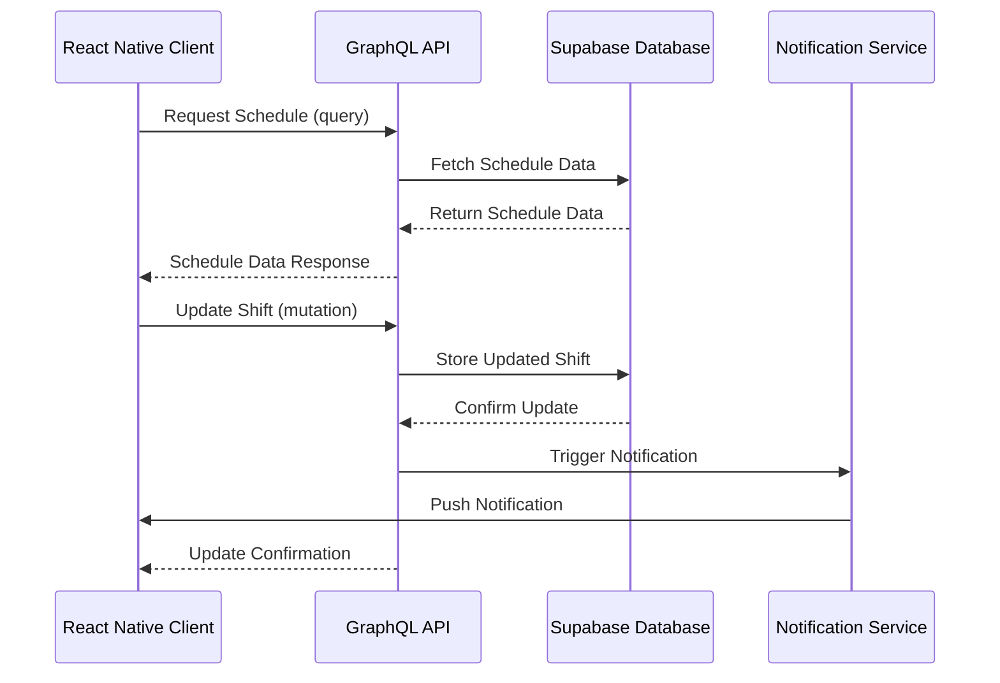

# Architecture Documentation

This directory contains the architectural documentation for the Employee Shift Schedule App. This documentation serves as the foundation for understanding the system's structure, components, and interactions.

## Purpose

The architecture documentation provides AI with a clear understanding of:

- How the system is structured
- How data flows through the system
- How components interact with each other
- Design decisions and their rationales

## What to Document Here

### System Architecture Diagrams

- High-level system architecture showing all major components
- Component interaction diagrams
- Client-server communication patterns
- Data flow diagrams
- Deployment architecture

### Database Architecture

- Database schema diagrams
- Entity relationship diagrams (ERD)
- Data access patterns
- Database migration strategies
- Indexing and optimization strategies

### API Architecture

- API structure and organization
- GraphQL schema documentation
- REST endpoint documentation
- Real-time data flow documentation
- API versioning strategy

### State Management

- State management architecture
- Client-side data flow diagrams
- Caching strategies
- Optimistic updates approach

### Security Architecture

- Authentication flow diagrams
- Authorization model
- Data encryption approach
- Security boundaries documentation

## File Structure

```
architecture/
├── system/                  # System-level architecture documentation
├── database/                # Database architecture documentation
├── api/                     # API architecture documentation
├── state-management/        # State management documentation
├── security/                # Security architecture documentation
└── diagrams/                # Source files for architecture diagrams
```

## Guidelines for AI Documentation

- Start each architectural document with a clear overview
- Include visual diagrams (using PlantUML, Mermaid, or similar)
- Document the rationale behind architectural decisions
- Cross-reference related architectural components
- Document both the current state and planned evolution
- Include performance considerations for each component
- Document dependencies between components
- Highlight potential bottlenecks or areas for future optimization

## Diagram Standards

- Use consistent notation across all diagrams
- Include a legend explaining symbols and colors
- Maintain a consistent level of abstraction within each diagram
- Ensure diagrams are simple enough to be understood at a glance
- Store diagram source files for future updates

## Example: Component Interaction Diagram



AI should document each component interaction with this level of detail, explaining the purpose of each step in the process.
